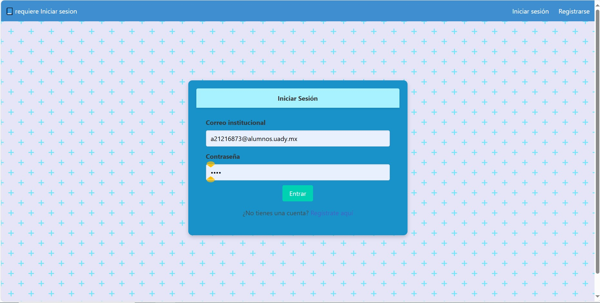
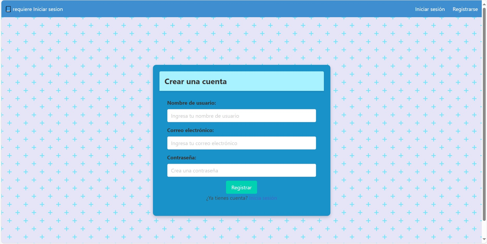
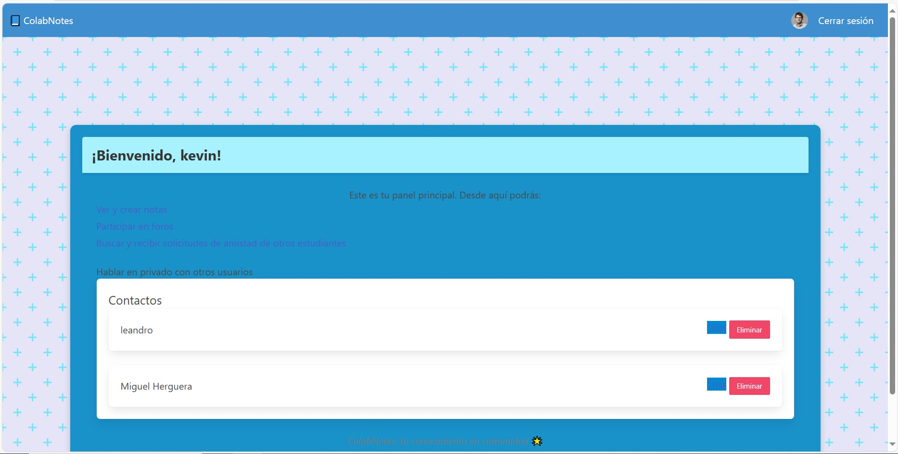
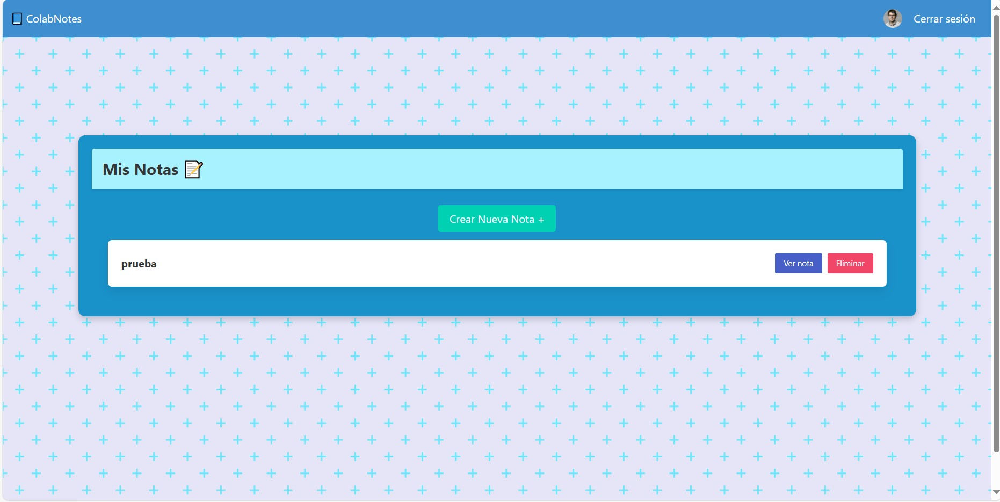
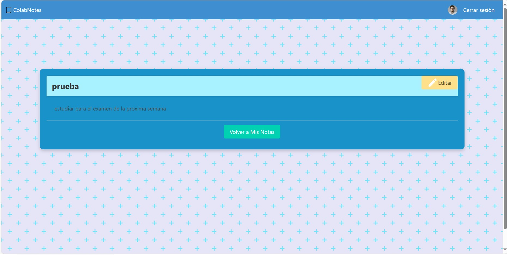
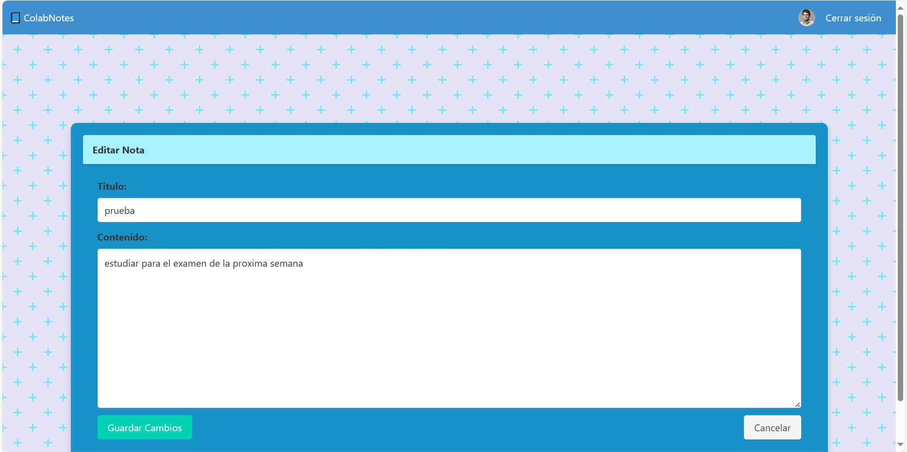
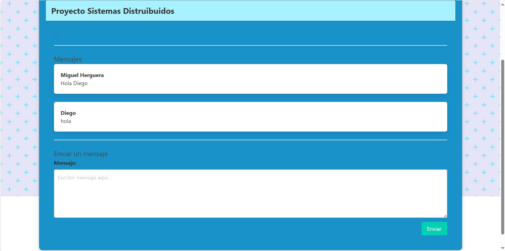
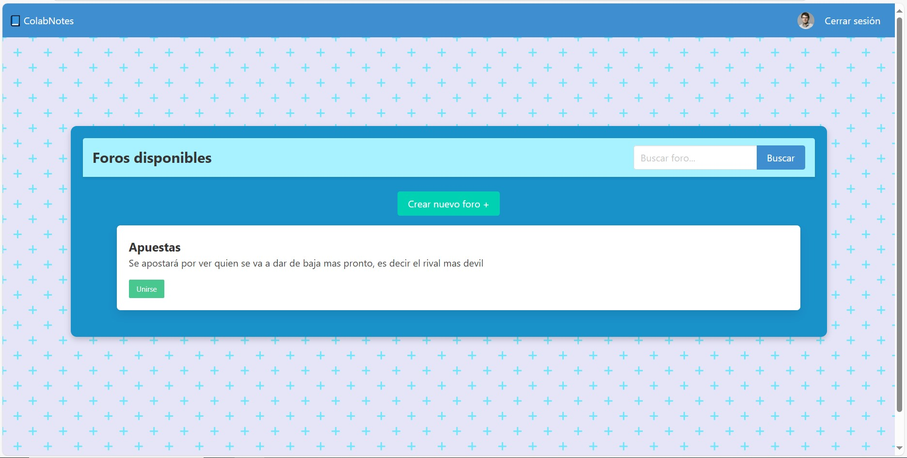
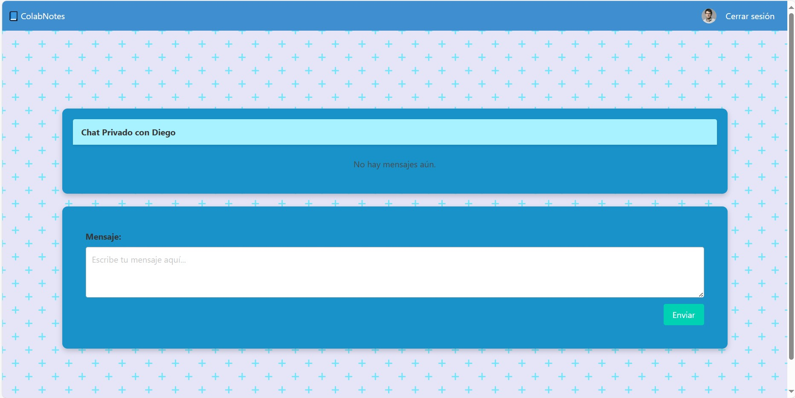
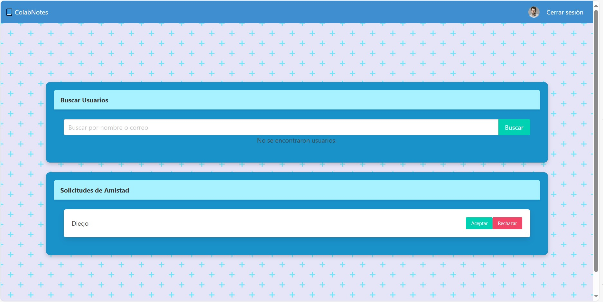

# 📘 ColabNotes

**ColabNotes** es una aplicación web enfocada en facilitar la colaboración entre alumnos a través de un foro académico. Los estudiantes pueden registrarse utilizando su correo institucional y una contraseña segura, interactuar con otros compañeros, crear notas y apoyarse mutuamente en sus estudios.

---

# 🧑‍🤝‍🧑 integrantes

- Kevin Leandro Camelo Suaste.
- Roger Aguila Uicab.
- Miguel Angel Gomez Hergera.
- Diego Alexander Rosado Valle.
---

## 🚀 Características principales

- Registro y autenticación de usuarios mediante correo institucional.
- Interfaz tipo foro para la comunicación entre alumnos.
- Creación, visualización y organización de notas.
- Sistema de apoyo académico entre compañeros.

---

## 🛠️ Tecnologías utilizadas

- [Python](https://www.python.org/)
- [Flask](https://flask.palletsprojects.com/)
- [Flask-Login](https://flask-login.readthedocs.io/)
- [Flask-SQLAlchemy](https://flask-sqlalchemy.palletsprojects.com/)

---

 ## Vistas de la interfaz de usuario

- 
  *Vista del inicio de sesión del usuario.*
- 
  *Vista deñ registro de Usuario*
- 
*Vista del menú principal* 
- 
*Vista previa de las notas personales del usuario* 
- 
*Vista detallada de una nota especifica* 
- 
*Vista de la edición de la nota generada* 
- 
*Vista previa de los foros a los que esta inscrito el usuario* 
- 
*Vista de una conversación de un foro* 
- 
*Vista previa de la busqueda de foros a los que el usuario no esta inscrito* 
- 
*Vista dentro de una conversación privada con un usuario de prueba* 
- 
*Vista previa de la busqueda de usuarios y recepción de solicitudes de amistad* 

---

## ⚙️ Instalación y ejecución

Sigue los pasos a continuación para ejecutar el proyecto localmente:

1. Abre tu terminal y navega a la carpeta principal del proyecto:
   ```bash
   cd ColabNotes

2. Crea un entorno virtual:
    ```bash
    python -m venv venv

3. Activa el entorno virtual:

    En Windows:
    ```bash
    venv\Scripts\activate

    En macOS/Linux:
    ```bash
    source venv/bin/activate

4. Instala las dependencias requeridas:

    ```bash
    pip install flask flask_sqlalchemy flask_login

5. Crea la base de datos (solo si no existe):

    ```bash
    python create_db.py

7. Ejecuta la aplicación:

    ```bash
    python run.py

    
La aplicación estará disponible en http://localhost:5000.
